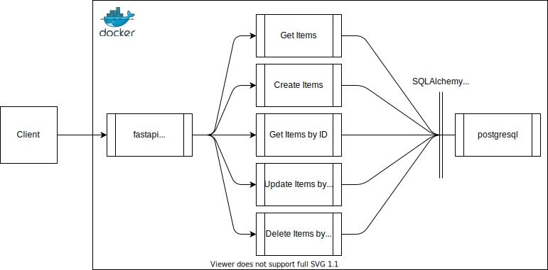
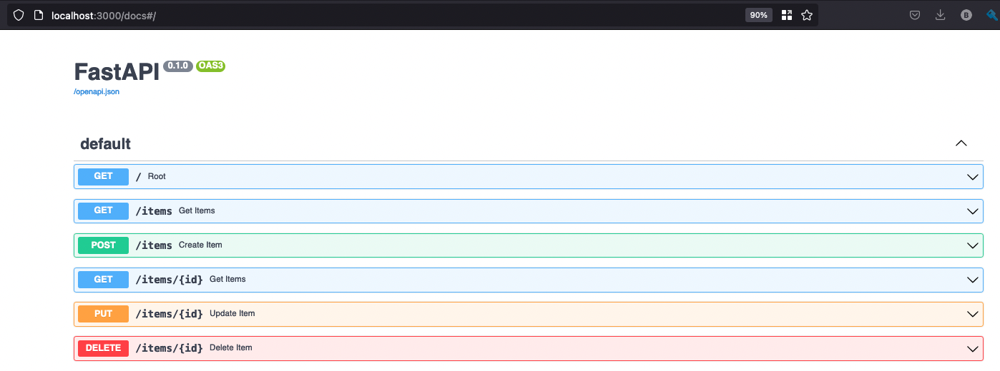

<!-- Intro -->
<br />
<div align="center">

<h3 align="center">Purple Cow Project</h3>

  <p align="center">
    It’s 2021, we are experiencing a pandemic and also a renewed civil rights movement is growing in our country. All Fearless employees are working from home. You are a Software Engineer on a project team that has been asked to create a series of proofs of concept that supports the customers public health and social justice initiatives. You have been assigned to build the proof of concept for an application called “Project Purple Cow”.
    <br />
  </p>
</div>


<!-- TABLE OF CONTENTS -->
<details>
  <summary>Table of Contents</summary>
  <ol>
    <li>
      <a href="#about-the-project">About The Project</a>
      <ul>
        <li><a href="#built-with">Built With</a></li>
      </ul>
    </li>
    <li>
      <a href="#getting-started">Getting Started</a>
      <ul>
        <li><a href="#prerequisites">Prerequisites</a></li>
        <li><a href="#installation">Installation</a></li>
      </ul>
    </li>
    <li><a href="#usage">Usage</a></li>
    <li><a href="#roadmap">Roadmap</a></li>
    <li><a href="#contributing">Contributing</a></li>
    <li><a href="#license">License</a></li>
    <li><a href="#contact">Contact</a></li>
    <li><a href="#acknowledgments">Acknowledgments</a></li>
  </ol>
</details>


<!-- ABOUT THE PROJECT -->
## About The Project

Must Haves
1. ReSTFUL Web application API that is served on port 3000
2. The API includes endpoints on the `/items` resource that allow a client to retrieve the current items, set the list of items, and delete all of the items
3. The endpoints accept/respond with payloads as json or json arrays, appropriate
4. The “Item” object should have two properties: id and name
5. Items should be persisted in memory while the application is running
6. Includes a Dockerfile that will run and serve the web application
7. Runs locally with a single startup command
8. Includes a solution.md that provides relevant documentation (see below) and how to build/run the solution

Nice to Haves
1. Includes a Dockerfile that creates a database that persists the items to local storage. The requirement to persist in memory is superseded by this nice-to-have; you are not required to do both.
2. The port the solution is served on is easily configurable without modifying the code and is documented in the solution.md
3. Implements other functions in the API like retrieving an item by id, updating the name of an item by id, deleting an item by id, etc
4. Implements other features to demonstrate your skills

<p align="right">(<a href="#readme-top">back to top</a>)</p>


### Built With

* FastAPI
* SQLAlchemy
* PostgreSQL



<p align="right">(<a href="#readme-top">back to top</a>)</p>


<!-- GETTING STARTED -->
## Getting Started
To get a local copy up and running follow these simple example steps.

### Prerequisites

* Docker
* Docker Compose

### Installation


1. Clone the repo
   ```sh
   git clone https://github.com/blakegreendev/purple_cow_project.git
   ```
2. Build Docker Image
   ```sh
   docker-compose up
   ```


<p align="right">(<a href="#readme-top">back to top</a>)</p>


<!-- USAGE EXAMPLES -->
## Usage
FastAPI provides a Swagger UI with interactive exploration, call and test the API directly in the browser. NOTE: make sure Docker containers are running.

- Go to http://localhost:3000/docs
- Create some items in the database by hitting the drop down for POST /items and click the *Try it out* button. Edit the request body with a unique name and then click Execute.

Resonse 
```json
{
  "data": {
    "name": "apple",
    "id": 1
  }
}
```
- Read by ID or all.
- Update by ID.
- Delete by ID.

<p align="right">(<a href="#readme-top">back to top</a>)</p>


<!-- ROADMAP -->
## Roadmap

- [ ] Testing
- [ ] Authentication
- [ ] 


<p align="right">(<a href="#readme-top">back to top</a>)</p>


<!-- CONTRIBUTING -->
## Contributing

1. Fork the Project
2. Create your Feature Branch (`git checkout -b feature/AmazingFeature`)
3. Commit your Changes (`git commit -m 'Add some AmazingFeature'`)
4. Push to the Branch (`git push origin feature/AmazingFeature`)
5. Open a Pull Request

<p align="right">(<a href="#readme-top">back to top</a>)</p>


<!-- LICENSE -->
## License

Distributed under the MIT License. 

<p align="right">(<a href="#readme-top">back to top</a>)</p>


<!-- CONTACT -->
## Contact

Your Name - [@blakegreendev](https://twitter.com/blakegreendev) - blakegreen@msn.com

Project Link: [https://github.com/blakegreendev/purple_cow_project](https://github.com/blakegreendev/purple_cow_project)

<p align="right">(<a href="#readme-top">back to top</a>)</p>


